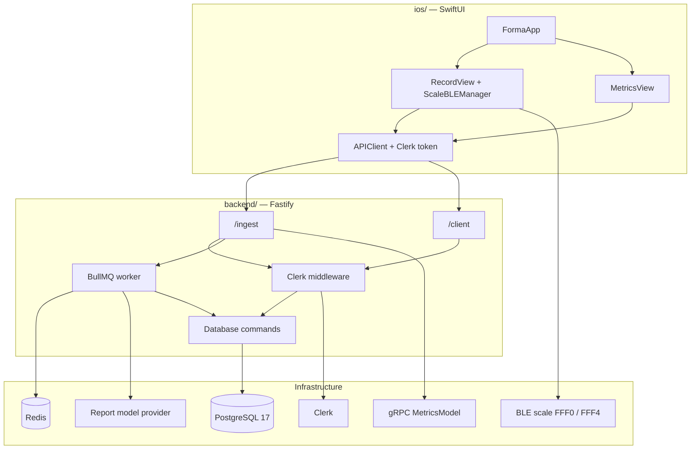

<div align="center">
  

  # Forma

  **From a Bluetooth scale reading to a longitudinal health record.**

  Native iOS client and authenticated backend for capturing smart-scale measurements, deriving body composition, and turning that history into insights, charts, and structured reports.

  [](https://www.swift.org)
  [](https://developer.apple.com/xcode/swiftui/)
  [](https://www.typescriptlang.org/)
  [](https://bun.sh/)
  [](https://fastify.dev/)
  [](https://www.postgresql.org/)
</div>

---

## What this repository is

This is the full Forma stack in one tree:

| Path | Role | Original project |
| --- | --- | --- |
| [`ios/`](./ios) | SwiftUI client: BLE scale capture, Clerk auth, charts, insight dashboards | [`aneeshpatne/Forma_IOS`](https://github.com/aneeshpatne/Forma_IOS) |
| [`backend/`](./backend) | Bun + Fastify API: ingestion, composition snapshots, trends, queued insight reports | [`aneeshpatne/healthmaxxing`](https://github.com/aneeshpatne/healthmaxxing) |

Both original repositories still exist and were not rewritten. Their default-branch history is imported here with paths moved under `ios/` and `backend/`, so `git log -- ios` and `git log -- backend` show each project's full commit timeline.

- iOS: 175 commits, starting 2026-06-19
- Backend: 274 commits, starting 2026-05-09

Per-package READMEs keep the deeper product, architecture, and operations detail:

- [iOS README](./ios/README.md)
- [Backend README](./backend/README.md)

## Overview

Forma connects to a supported Bluetooth Low Energy scale, captures weight, impedance, and heart rate, and submits the reading to an authenticated API. The backend stores the raw measurement, derives body-composition metrics, queues insight generation, and returns snapshots, trends, and structured reports. The iOS app polls those jobs and renders gauges, composition maps, and recommendations.

Shared identity is Clerk. The iOS client sends a bearer token; the API upserts that identity into a local account and scopes every profile read or write to that account.

## From scale to insight

```mermaid
flowchart LR
    U([User]) --> A[Clerk sign-in]
    A --> P[Primary profile]
    P --> R[Start a reading]
    R --> B{BLE scale}
    B --> W[Weight]
    W --> I[Impedance]
    I --> H[Heart rate]
    H --> API[Authenticated /ingest API]
    API --> D[(Raw measurement)]
    D --> E[gRPC metric model]
    E --> F[Derived composition]
    F --> Q[Redis job queue]
    Q --> J[Report worker]
    J --> C[(Completed insight)]
    C --> UI[iOS insights dashboard]
```



The recording screen keeps each scale stage visible even when packets arrive almost together. Ingestion persists the raw reading before metric calculation, so a downstream failure can be backfilled without repeating the weigh-in. Report state is stored as `queued`, `running`, `completed`, or `failed`; the app polls, caches the latest completed report on-device, and retries without taking another measurement.

## Product surface

| Area | Client | Backend |
| --- | --- | --- |
| **Accounts and profiles** | Sign-in, primary profile gate, create/edit flows | Clerk → local account, multi-profile, ownership checks |
| **Smart-scale recording** | BLE discovery, packet validation, staged capture UI | Weight, heart rate, and impedance ingestion with idempotency keys |
| **Body composition** | Insights, performance, fat, and muscle dashboards | BMI, fat/lean mass, hydration, muscle, BMR, FMI, FFMI, targets |
| **Progress** | Trend charts, effort score, recommendations | 7d / 30d / all-history summaries and circumference history |
| **Workouts** | — | Upsert by source id, including the original payload |
| **Insight reports** | Job polling, pull-to-refresh, protected local cache | Performance, fat, muscle, and profile-insight snapshots via BullMQ |
| **Native experience** | SwiftUI, Swift Charts, Reduce Motion, iPhone/iPad | Fastify `/ingest` and `/client` APIs, `/health`, startup migrations |

## Proof points

These figures were read from the configured PostgreSQL database on August 21, 2026. They are development-dataset counts, not claims about users or production adoption.

| Scope | Concrete fact |
| --- | --- |
| **Data volume** | 2 accounts, 3 profiles, 174 scale measurements, 1 body-measurement record, and 14 workouts. |
| **Derived history** | 174 body-composition snapshots, 174 FMI/FFMI rows, and 174 each of performance, fat, and muscle report snapshots. |
| **Insight pipeline** | 167 profile-insight reports: 115 completed and 52 failed; 113 structured JSON-LD outputs are persisted. |
| **API surface** | 27 registered HTTP handlers: 22 client routes, 4 ingest routes, and 1 database health check. |
| **Schema evolution** | 27 initial tables and 17 initial indexes; 15 migrations applied in the live database. |
| **Reliability** | 10 MB request cap, per-profile measurement idempotency, persisted job states, three report attempts with exponential backoff. |
| **Verification** | 26 focused Bun tests plus TypeScript typecheck; iOS unit tests for BLE decoding, record flow, and report payload/cache round-trips. |

## Architecture



The iOS networking layer is request-driven: each endpoint conforms to `APIRequest`, and `APIClient` handles URL construction, Clerk bearer tokens, encoding, and decoding. On the server, Fastify schemas validate request shapes, shared pre-handlers authenticate `/ingest` and `/client`, and profile-scoped handlers return `404` when the profile does not belong to the caller.

## Tech stack

| Layer | iOS | Backend |
| --- | --- | --- |
| **Language** | Swift 5, main-actor isolation | TypeScript 6, strict compiler checks |
| **UI / HTTP** | SwiftUI, Swift Charts | Fastify 5.9, `@fastify/websocket` |
| **Runtime** | iOS / iPadOS 26.5+ | Bun 1.3 |
| **Device / jobs** | CoreBluetooth | BullMQ 5.79 + Redis |
| **Auth** | ClerkKit | `@clerk/backend` + `@clerk/fastify` |
| **Data** | UserDefaults + protected Application Support cache | PostgreSQL 17, Bun `SQL` |
| **Insights** | Codable report payloads, job polling | LangChain + configured model provider |
| **Metrics** | Presents derived snapshots | gRPC `MetricsModel` (external service) |

## Repository layout

```text
.
├── ios/                          # Forma SwiftUI app
│   ├── Forma/                    # App target
│   ├── FormaTests/
│   ├── FormaUITests/
│   └── Forma.xcodeproj
├── backend/                      # Healthmaxxing API
│   ├── src/                      # Fastify app, routes, workers, SQL
│   ├── migrations/
│   ├── proto/                    # gRPC contracts
│   └── docker-compose.yml        # Local PostgreSQL 17
└── README.md
```

## Getting started

The two packages are still independent runtimes. Start the API before exercising live measurement or report flows in the app.

### Backend

Requires Bun 1.3, Docker, Redis, a Clerk secret, a reachable `MetricsModel` gRPC service, and a model-provider key. Full environment notes live in [`backend/README.md`](./backend/README.md).

```bash
cd backend
bun install
cp .env.example .env
# fill CLERK_SECRET_KEY, REDIS_URL, OPENAI_API_KEY, METRICS_MODEL_ADDRESS
bun run db:up
bun run db:migrate
bun run start
```

### iOS

Requires Xcode 26.5+ and an iOS 26.5+ simulator or device. Live scale capture needs a physical device and a BLE scale exposing service `FFF0` / characteristic `FFF4`.

```bash
open ios/Forma.xcodeproj
```

Review `ios/Forma/ClerkConfig.swift` and `ios/Forma/Networking/APIConfig.swift` before running. The app currently points at the hosted Forma API (`https://forma.aneeshpatne.com`) and a Clerk test environment.

## History

This monorepo was assembled without changing the source repositories. Each project's commits were rewritten so files live under `ios/` or `backend/`; authors, messages, and timestamps are preserved.

```bash
git log -- ios        # Forma client history
git log -- backend    # Healthmaxxing API history
```

Feature branches that were never merged to `main` remain on the original remotes.

## License

Licenses stay with their original packages:

- [`backend/`](./backend/LICENSE) — Apache License 2.0
- [`ios/`](./ios/LICENSE) — GNU Affero General Public License v3.0
