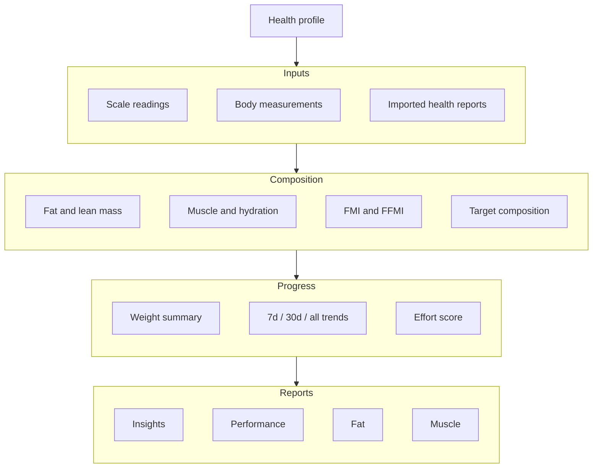

<div align="center">
  

  # Healthmaxxing

  **Turn a scale reading into a body-composition history you can understand.**

  Healthmaxxing combines the Forma SwiftUI client with a Bun/Fastify service to capture Bluetooth smart-scale measurements, derive body-composition metrics, and deliver asynchronous insight reports with gauges, trends, and structured payloads.

  [](https://www.swift.org)
  [](https://www.typescriptlang.org/)
  [](https://developer.apple.com/ios/)
  [](https://bun.sh/)
  [](./LICENSE)

  [Hosted API](https://forma.aneeshpatne.com) · [Forma client README](./ios/README.md) · [Server README](./backend/README.md)
</div>

---

## Overview

Forma captures weight, impedance, and heart rate from a supported Bluetooth Low Energy scale. The server authenticates the profile, stores the raw measurement, calculates body-composition values, and starts an insight-report job. The user receives a longitudinal view of weight, fat, lean mass, muscle, hydration, FMI, FFMI, targets, trends, and structured recommendations instead of an isolated scale result.

The repository is a two-runtime system: a native SwiftUI iOS/iPadOS client and a TypeScript service running on Bun and Fastify. Clerk scopes access to the account and profile, PostgreSQL stores the history, an external gRPC `MetricsModel` calculates composition values, and Redis/BullMQ moves report generation into a persisted asynchronous workflow. The client uses typed `URLSession` requests, Swift Charts, protected report caching, and an accessible motion system.

## Why this project

A scale exposes several raw signals, but raw signals do not explain whether a change is meaningful or how it fits into a person's history. Healthmaxxing turns those signals into comparable composition snapshots and report sections while keeping the original reading available for recovery when a downstream service is unavailable.

## Engineering outcomes

These are dated observations from the repository's development workload and configured PostgreSQL database, not production adoption claims.

| Outcome | Result |
| --- | --- |
| **Smaller structured report contract** | Reduced top-level report cards from **42 to 20** (**−52%**) during the July 19, 2026 schema streamline. |
| **Lower observed model usage** | Reduced mean total tokens per insight run from **24,997 to 10,356** (**−59%**) across 48 pre-change and 100 post-change worker runs. |
| **Lower median model usage** | Reduced median total tokens per insight run from **26,507 to 8,136** (**−69%**) over the same observed cohorts. |
| **One reading, multiple client surfaces** | Each accepted reading can produce a composition snapshot, FMI/FFMI values, performance/fat/muscle report rows, and a queued profile-insight job. |
| **Explicit failure recovery** | Raw measurements are persisted before composition calculation; failed or stale processing remains visible and can be recovered through authenticated backfill paths. |

### Current implementation snapshot

The following counts were queried from the configured PostgreSQL database on **August 27, 2026**. They describe the current development dataset, not system capacity or production scale.

| Metric | Count |
| --- | ---: |
| Scale measurements | 185 |
| Body-composition snapshots | 185 |
| FMI / FFMI rows | 185 |
| Reports generated | 736 |
| Completed / failed profile-insight jobs | 126 / 52 |
| Structured JSON-LD insight payloads | 124 |
| Imported health reports / extracted observations | 3 / 38 |
| PostgreSQL tables / indexes | 30 / 68 |
| Applied migrations | 15 |

## Features

| Area | What the project provides |
| --- | --- |
| **Smart-scale recording** | Discovers a BLE scale on service `FFF0`, listens on characteristic `FFF4`, validates packets, and presents weight → impedance → heart rate as an ordered recording flow. |
| **Accounts and profiles** | Uses Clerk on the client and server, maps identities to local accounts, supports multiple profiles, stores a primary profile, and enforces profile ownership on profile-scoped requests. |
| **Body composition** | Stores derived BMI, fat and lean mass, water and protein percentages, muscle values, BMR, body age, visceral fat, FMI, FFMI, and target-weight calculations. |
| **Longitudinal analytics** | Exposes essentials, weight history, 30-day summaries, circumference history, and body-composition trends over `7d`, `30d`, or all available history. |
| **Insight reports** | Renders overview, foundation, progress, recommended focus, physique archetype, effort score, performance, fat, and muscle report sections from structured server output. |
| **Asynchronous processing** | Returns a job id after ingestion, persists `queued` → `running` → `completed` / `failed` states, retries report generation three times with exponential 2-second backoff, and supports bounded long-polling. |
| **Client-side continuity** | Remembers pending jobs, supports refresh and cancellation, and caches the latest completed report per profile using atomic, protected Application Support writes. |
| **Historical recovery** | Provides an authenticated body-composition backfill for missing or stale derived rows and preserves calculation errors on the measurement record. |

> [!NOTE]
> The Forma client, authentication, profiles, recording flow, measurement ingestion, composition snapshots, dashboards, and queued insight reports are implemented. The external `MetricsModel` gRPC calculator and Redis are required dependencies but are not included in this repository. The repository contains no screenshot or hosted product demo asset; the app's configured API base URL is linked above.

## From scale to insight

```mermaid
flowchart LR
    U([User]) --> A[Clerk sign-in]
    A --> P[Primary profile]
    P --> R[Forma Record]
    R --> B[BLE scale]
    B --> M[Weight + impedance + heart rate]
    M --> I[POST /ingest/add_measurement/v2]
    I --> D[(Raw measurement)]
    D --> C[gRPC MetricsModel]
    C --> S[(Composition snapshot)]
    S --> Q[Redis / BullMQ]
    Q --> W[Report worker]
    W --> J[(Insight report)]
    J --> L[Bounded wait / report API]
    L --> UI[Forma Metrics]
    L -->|queued or running| L
```



The ingest path writes the raw reading before calling the external calculator. Measurement requests can include an `Idempotency-Key`; a replay returns the existing processing result instead of creating another reading. The report worker requires structured output to be persisted before marking a job complete. The client waits in one-second intervals, defaults to 25 seconds, clamps the request to 30 seconds, and continues polling until completion, failure, cancellation, or timeout.

## Product map



## Architecture

```mermaid
flowchart TB
    subgraph CLIENT[Forma — ios/]
        direction TB
        APP[FormaApp] --> AUTH_UI{Authenticated?}
        AUTH_UI -->|No| SIGNIN[ClerkSignInView]
        AUTH_UI -->|Yes| PROFILE[Primary profile gate]
        PROFILE --> TABS[Metrics / Record / Settings]
        TABS --> BLE[ScaleBLEManager]
        TABS --> STORE[MetricsReportStore]
        STORE --> API_CLIENT[APIClient]
        API_CLIENT --> TOKEN[Clerk token provider]
    end

    subgraph SERVER[Healthmaxxing Server — backend/]
        direction TB
        FASTIFY[Fastify application] --> INGEST[/ingest routes]
        FASTIFY --> CLIENT_API[/client routes]
        FASTIFY --> HEALTH[/health]
        INGEST --> AUTH[Auth middleware]
        CLIENT_API --> AUTH
        AUTH --> COMMANDS[Database commands]
        INGEST --> CALC[Composition calculations]
        INGEST --> QUEUE[Queue producer]
        QUEUE --> WORKER[Report worker]
    end

    subgraph SERVICES[External services]
        CLERK[Clerk]
        METRICS[MetricsModel gRPC]
        REDIS[(Redis)]
        POSTGRES[(PostgreSQL)]
        MODEL[Configured report model]
    end

    API_CLIENT --> INGEST
    API_CLIENT --> CLIENT_API
    TOKEN --> CLERK
    AUTH --> CLERK
    CALC --> METRICS
    COMMANDS --> POSTGRES
    QUEUE --> REDIS
    WORKER --> MODEL
    WORKER --> COMMANDS
```

The client owns presentation state and request orchestration; `APIRequest` types define the request path, method, headers, query, body, and response. `APIClient` attaches the Clerk bearer token, encodes JSON, sends the request, and decodes the typed response. `MetricsReportStore` translates persisted report JSON into sections used by the Metrics tabs.

The server separates write-oriented `/ingest` routes from client-facing `/client` routes. Shared authentication middleware resolves a Clerk user to a local account, and profile-scoped handlers return `404` for profiles outside that account. Database access is centralized through Bun's SQL client and a PostgreSQL query adapter. Migrations run before the server listens; multi-row updates and backfills use transactions. API and worker shutdown handlers close the relevant resources on `SIGINT` and `SIGTERM`.

## Engineering decisions

| Decision | Reason | Trade-off |
| --- | --- | --- |
| **Persist the raw reading before calculation** | Keeps the original measurement available when the external gRPC calculation fails and makes recovery possible. | A reading can temporarily exist without a derived composition snapshot. |
| **Use a queued report worker** | Keeps model-dependent report generation out of the measurement request and gives each job a persisted lifecycle. | Redis, a worker process, retries, and stale-job handling become runtime dependencies. |
| **Scope idempotency to the profile** | A stable client key can safely replay a submission without duplicating that profile's reading. | Callers must preserve the key when retrying the same logical submission. |
| **Require persisted structured output before completion** | Prevents a job from appearing complete when the report agent returned without storing a client-readable payload. | Completion requires an additional persistence verification step. |
| **Keep the external metric calculator behind gRPC** | Makes the calculation boundary explicit and keeps the protocol contract in `backend/proto/`. | Local setup requires a separately running service that implements the contract. |

## Tech stack

| Layer | Technology |
| --- | --- |
| **iOS client** | Swift 5, SwiftUI, Swift Charts, CoreBluetooth, Swift concurrency |
| **Authentication** | [Clerk iOS SDK](https://github.com/clerk/clerk-ios), [`@clerk/backend`](https://www.npmjs.com/package/@clerk/backend), [`@clerk/fastify`](https://www.npmjs.com/package/@clerk/fastify) |
| **Server runtime** | [Bun](https://bun.sh/) 1.3, [TypeScript](https://www.typescriptlang.org/) 6, [Fastify](https://fastify.dev/) 5.9 |
| **Persistence** | PostgreSQL 17 through Bun's `SQL` client; protected JSON report cache on iOS |
| **Metric calculation** | gRPC, Protocol Buffers, and the external `MetricsModel` service |
| **Async jobs** | [BullMQ](https://docs.bullmq.io/) 5.79 with Redis |
| **Report generation** | [LangChain](https://www.langchain.com/) 1.5 with the configured model provider and 24-hour prompt-cache retention |
| **Testing** | Bun test runner, TypeScript type checking, Swift Testing, and XCUITest |
| **Local operations** | Docker Compose for PostgreSQL; optional macOS `launchd` automation for the server |

## Current limitations

- The `MetricsModel` gRPC service is external to this repository.
- Redis is required for report jobs but is not defined in `backend/docker-compose.yml`.
- The local Compose setup provisions PostgreSQL only; shared or production deployments must provide their own PostgreSQL, Redis, Clerk, metrics-service, and model-provider configuration.
- Backend tests do not cover Clerk authentication, gRPC calculation, Redis jobs, or HTTP routes end to end.
- The iOS client has a fixed API base URL and Clerk publishable key in source configuration; forks need to review those values before distribution.

## Project structure

```text
.
├── ios/                              # Forma iOS/iPadOS client
│   ├── Forma/
│   │   ├── FormaApp.swift            # App entry and Clerk setup
│   │   ├── ContentView.swift         # Auth and primary-profile gate
│   │   ├── SwiftUIView.swift         # Metrics / Record / Settings tabs
│   │   ├── RecordView.swift          # Guided BLE measurement flow
│   │   ├── ScaleBLEManager.swift     # Scale discovery and notifications
│   │   ├── Metrics/                  # Insights, Performance, Fat, Muscle
│   │   └── Networking/               # Authenticated API clients and cache
│   ├── FormaTests/                   # Swift Testing unit cases
│   ├── FormaUITests/                 # XCUITest cases
│   └── Forma.xcodeproj
├── backend/                          # Healthmaxxing Server
│   ├── src/
│   │   ├── app.ts                    # Fastify plugins and /health
│   │   ├── main.ts                   # API plus report-worker entry point
│   │   ├── routes/                   # Ingest and client-facing routes
│   │   ├── middleware/               # Clerk auth and account resolution
│   │   ├── calculations/             # Composition summaries and targets
│   │   ├── bull/                     # Redis queue and worker lifecycle
│   │   └── db/                       # SQL client and persistence commands
│   ├── migrations/                   # PostgreSQL schema history
│   ├── proto/                        # gRPC service contracts
│   ├── scripts/                      # Migration and data-management tools
│   └── docker-compose.yml            # Local PostgreSQL 17
├── LICENSE                           # Root and package license notice
└── README.md
```

Package-level details are available in [`ios/README.md`](./ios/README.md) and [`backend/README.md`](./backend/README.md).

## Requirements

### Forma

- macOS with Xcode 26.5 or newer.
- iOS/iPadOS 26.5 or newer; the project targets both iPhone and iPad families.
- A Clerk application accepted by the configured publishable key.
- Network access to Healthmaxxing Server.
- A compatible BLE scale exposing service `FFF0` and notify characteristic `FFF4` for live recording.

Analytics can run in the iOS Simulator. Live scale capture requires a physical iPhone or iPad with Bluetooth.

### Healthmaxxing Server

- Bun 1.3; the repository is currently validated with Bun 1.3.14.
- Docker and Docker Compose for the bundled PostgreSQL 17 development service.
- A Clerk application and `CLERK_SECRET_KEY`.
- A reachable implementation of `proto/metrics_model.proto`; the default address is `localhost:50054`.
- Redis for report jobs; the default connection is `redis://localhost:6379`.
- `OPENAI_API_KEY` for the configured report model.
- Network access for dependency installation, Clerk verification, and model calls.

## Getting started

1. Clone the repository.

   ```bash
   git clone https://github.com/aneeshpatne/healthmaxxing.git
   cd healthmaxxing
   ```

2. Configure the server.

   ```bash
   cd backend
   bun install
   cp .env.example .env
   ```

   `backend/.env.example` contains the local database and metrics-service defaults. Add the credentials and optional runtime settings needed by the server:

   ```dotenv
   CLERK_SECRET_KEY=replace-with-a-clerk-secret
   REDIS_URL=redis://localhost:6379
   OPENAI_API_KEY=replace-with-an-openai-key
   PORT=3030
   HOST=0.0.0.0
   ```

   > [!IMPORTANT]
   > Keep provider keys out of version control. Replace the local database credentials and review the Clerk values before using a fork or shared deployment. Do not commit a populated `.env` file.

3. Start PostgreSQL and apply migrations.

   ```bash
   bun run db:up
   bun run db:migrate
   ```

4. Start Redis and the external `MetricsModel` gRPC service so their addresses match `.env`. Then run the API and report worker:

   ```bash
   bun run start
   ```

   For the API without the report worker:

   ```bash
   bun run server
   ```

   Both server entry points run migrations before listening. Check the database probe at `http://localhost:3030/health`.

5. Open the iOS project.

   ```bash
   open ../ios/Forma.xcodeproj
   ```

   Xcode resolves the Clerk Swift package. Review `ios/Forma/ClerkConfig.swift`, `ios/Forma/Networking/APIConfig.swift`, and `ios/Forma/Info.plist`. To use a local server, point `APIConfig.baseURL` at it instead of the configured hosted URL.

6. Select an iOS 26.5+ simulator or physical device, run with **⌘R**, sign in, and create a primary profile. The primary profile is required before the main tabs are shown.

## Running tests

### Healthmaxxing Server

```bash
cd backend
bun run test
bun run typecheck
```

The Bun suite currently contains **26 tests across 5 files** covering query translation, trend calculations, profile-context formatting, composition targets, metric validation, and insight-payload normalization. The typecheck command runs `tsc --noEmit`.

### Forma

Run `FormaTests` and `FormaUITests` from Xcode with **⌘U**, or use:

```bash
cd ios
DEVELOPER_DIR=/Applications/Xcode.app/Contents/Developer \
xcodebuild test \
  -project Forma.xcodeproj \
  -scheme Forma \
  -destination 'platform=iOS Simulator,name=<your simulator>'
```

The iOS suite contains **20** Swift Testing cases and **7** XCUITest cases covering BLE packet decoding, ordered recording, idle-timer handling, chart helpers, report payload/cache round-trips, tab shells, loading/error states, and launch performance measurement. Combined with the Bun suite, the repository contains **53 automated tests**.

## Roadmap

- Make the iOS API base URL and Clerk key configurable per build configuration.
- Support additional smart-scale protocols beyond `FFF0` / `FFF4`.
- Add Redis and the external metrics service to reproducible local orchestration.
- Automate composition snapshot recovery when the gRPC calculation step fails.
- Add integration coverage for profile isolation, ingest → job → report, and iOS polling.
- Publish an OpenAPI reference from the existing Fastify route schemas.
- Add production measurements for API latency percentiles and report-job duration.

## License

This repository uses two licenses:

- Root documentation and `backend/` are licensed under the [Apache License 2.0](./LICENSE).
- The Forma client under `ios/` is licensed under the [GNU Affero General Public License v3.0](./ios/LICENSE).

See the linked license files for the complete terms.

---

<div align="center">
  Built with SwiftUI, Bun, PostgreSQL, and a preference for turning measurements into useful history.
</div>
