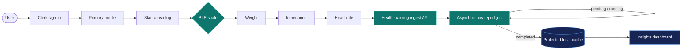
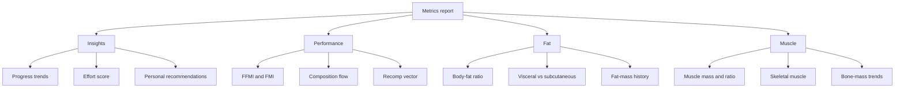
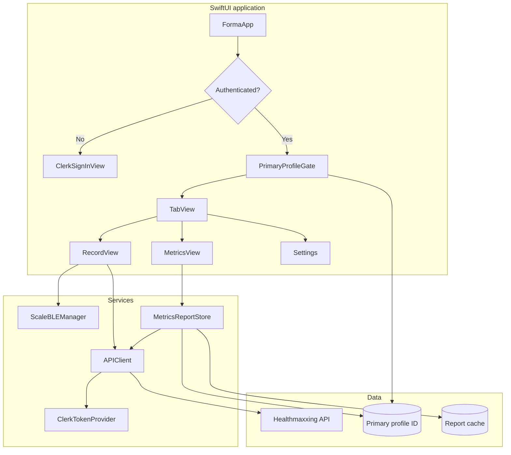
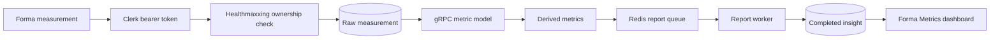

<div align="center">
  

  # Forma

  **Your body, understood over time.**

  A polished iOS body-composition companion that records smart-scale measurements and turns them into clear, personal fitness insights.

  [](https://www.swift.org)
  [](https://developer.apple.com/ios/)
  [](https://developer.apple.com/xcode/swiftui/)
  [](https://github.com/aneeshpatne/healthmaxxing)
  [](LICENSE)
</div>

---

## Overview

Forma connects to a supported Bluetooth Low Energy scale, captures weight, impedance, and heart rate, and securely submits the reading to **[Healthmaxxing](https://github.com/aneeshpatne/healthmaxxing)** — the Bun and Fastify backend that stores profiles, derives body-composition metrics, and generates insight reports. The resulting report is presented through gauges, trend lines, composition maps, and focused recommendations designed to make long-term progress easier to understand.

The interface is built entirely in SwiftUI, uses Swift Charts for data visualization, and follows a dark, glass-inspired visual system with accessible motion handling and a custom Cormorant Garamond wordmark. This repository is the iOS client. The server, schema, report workers, and API live in [aneeshpatne/healthmaxxing](https://github.com/aneeshpatne/healthmaxxing).

## Features

| Area | What Forma provides |
| --- | --- |
| **Smart-scale recording** | Discovers a BLE scale, streams weight → impedance → heart rate, validates packets, and presents each stage in a focused recording flow. |
| **Personal insights** | Displays an overview, foundation, progress, recommended focus, physique archetype, and a 0–100 effort score from the latest report. |
| **Performance analytics** | Includes FFMI and excess-fat gauges, an FMI-vs-FFMI quadrant, body-composition flow, composition trends, and recomp vectors. |
| **Fat analytics** | Tracks body-fat ratio, visceral and subcutaneous fat, total fat mass, and changes over time with gauges, donut charts, and trend charts. |
| **Muscle analytics** | Surfaces muscle mass, muscle ratio, skeletal muscle, and bone-mass trends when available in the report. |
| **Profiles** | Creates and edits client profiles, stores the primary profile locally, and supports profile-specific goals and measurements. |
| **Authentication** | Uses Clerk for sign-in, session-backed API authorization, and account management. |
| **Resilient reports** | Polls asynchronous report jobs, supports pull-to-refresh, remembers pending jobs, and caches the latest completed report on-device. |
| **Native experience** | Uses SwiftUI navigation, Swift Charts, adaptive system colors, Liquid Glass controls, Reduce Motion support, and iPhone/iPad layouts. |

> [!NOTE]
> Metrics, recording, authentication, profiles, and settings are implemented.

## From scale to insight



The recording screen keeps metrics readable even when the scale sends values almost simultaneously. Each stage remains visible briefly, the device idle timer is leased during a reading, and failed submissions can be retried without repeating the measurement.

## Analytics at a glance



## Architecture



The networking layer is request-driven: each endpoint conforms to `APIRequest`, while `APIClient` handles URL construction, Clerk bearer tokens, JSON encoding, status validation, and decoding. UI state stays on the main actor and report data is converted into presentation-friendly sections by `InsightReportPayload`.

## Backend: Healthmaxxing

Forma does not include a server. Profiles, measurement ingestion, composition math, and insight reports are provided by **[Healthmaxxing](https://github.com/aneeshpatne/healthmaxxing)**.

[Healthmaxxing](https://github.com/aneeshpatne/healthmaxxing) is an authenticated health-data service that converts scale readings, body measurements, and workouts into body-composition history, progress summaries, and structured insight reports. It is a TypeScript application on Bun and Fastify, with Clerk authentication, PostgreSQL persistence, gRPC-based metric calculation, and BullMQ-backed report jobs.

| Area | What Healthmaxxing provides |
| --- | --- |
| **Accounts and profiles** | Resolves Clerk users to local accounts, supports multiple profiles per account, assigns a primary profile, and keeps profile metadata and targets editable. |
| **Scale ingestion** | Accepts weight, heart rate, and impedance readings, stores the raw measurement, then calculates the corresponding composition snapshot. |
| **Body composition** | Records BMI, body-fat and lean-mass values, water and protein percentages, muscle measurements, BMR, body age, visceral fat, FMI, FFMI, and target weight. |
| **Progress tracking** | Returns essentials, weight history, 30-day summaries, circumference history, and metric trends over `7d`, `30d`, or the full available history. |
| **Workout sync** | Upserts workouts by source identifier and preserves timing, energy, heart-rate, distance, cadence, environment, metadata, and the original payload. |
| **Insight reports** | Creates performance, fat, muscle, and profile-insight snapshots for a measurement and exposes recent reports, active jobs, completion states, and report lookup. |
| **Operations** | Applies ordered SQL migrations before listening, reports PostgreSQL availability through `GET /health`, and shuts down cleanly on termination signals. |

The API is split into write-oriented `/ingest` routes and client-facing `/client` routes. This iOS app talks to the hosted instance at the URL in `Forma/Networking/APIConfig.swift` using a Clerk bearer token. The calls it makes today are:

| Forma flow | Healthmaxxing route |
| --- | --- |
| Create a profile | `POST /client/register/profiles/v2` |
| List profiles | `GET /client/profiles` |
| Edit a profile | `PATCH /client/profiles/:profileId` |
| Submit a scale reading | `POST /ingest/add_measurement/v2` |
| Poll an in-flight report | `GET /client/profiles/:profileId/insights/jobs/active` and `.../jobs/:jobId/wait` |
| Load a completed report | `GET /client/profiles/:profileId/insights/report-ids/latest` and `.../insights/:insightId` |

Measurement ingestion persists the raw reading before calling the metric service, then queues insight generation. Report state is stored as `queued`, `running`, `completed`, or `failed`. Forma polls the wait endpoint (up to 30 seconds) and can retry later from the cached job id.



Healthmaxxing also exposes workout ingestion, circumference history, backfill, and broader progress APIs that this client does not yet call. The metrics calculator is a separate gRPC service and is not included in the Healthmaxxing repository.

For local setup (Bun, PostgreSQL, Redis, Clerk secret, metric-service address), migrations, and the full route map, use the Healthmaxxing README:

**[github.com/aneeshpatne/healthmaxxing](https://github.com/aneeshpatne/healthmaxxing)**

## Tech stack

| Layer | Technology |
| --- | --- |
| Language | Swift 5 language mode with approachable concurrency and main-actor isolation |
| UI | SwiftUI |
| Visualization | Swift Charts and custom SwiftUI shapes |
| Device integration | CoreBluetooth |
| Authentication | [ClerkKit and ClerkKitUI](https://github.com/clerk/clerk-ios) 1.2.6+ |
| Networking | URLSession, async/await, Codable |
| Persistence | UserDefaults and protected JSON files in Application Support |
| Backend | [Healthmaxxing](https://github.com/aneeshpatne/healthmaxxing) — Bun, Fastify, PostgreSQL, Clerk, BullMQ |
| Testing | Swift Testing and XCUITest |

## Project structure

```text
Forma/
├── FormaApp.swift                 # Application entry point and Clerk setup
├── ContentView.swift              # Authentication and profile gate
├── SwiftUIView.swift              # Root tabs and global navigation
├── RecordView.swift               # Guided measurement experience
├── ScaleBLEManager.swift          # BLE discovery and scale communication
├── Profiles.swift                 # Profile list and create/edit flows
├── Metrics/
│   ├── Insights/                  # Summaries, recommendations, and effort
│   ├── Performance/               # FFMI, composition, and recomp visuals
│   ├── Fat/                       # Fat gauges, breakdowns, and trends
│   └── Muscle/                    # Muscle and bone trend cards
├── Networking/
│   ├── APIClient.swift            # Shared authenticated HTTP client
│   ├── Measurements/              # Measurement ingestion requests
│   ├── Profiles/                  # Profile requests and models
│   └── Insights/                  # Report jobs, payloads, polling, and cache
└── Assets.xcassets/               # App icon and body illustrations

FormaTests/                        # Decoder, record-flow, and report tests
FormaUITests/                      # UI and launch tests
```

## Requirements

- macOS with **Xcode 26.5 or newer**
- **iOS/iPadOS 26.5+** deployment target
- A Clerk account accepted by the configured Forma environment (the same Clerk application used by Healthmaxxing)
- Network access to a [Healthmaxxing](https://github.com/aneeshpatne/healthmaxxing) API for profiles, measurement uploads, and reports
- A compatible BLE scale exposing service `FFF0` and notify characteristic `FFF4` for live recordings

The analytics screens can run in Simulator, but live scale capture requires a physical iPhone or iPad with Bluetooth enabled.

## Getting started

1. Clone the repository:

   ```bash
   git clone https://github.com/aneeshpatne/Forma_IOS.git
   cd Forma_IOS
   ```

2. Open `Forma.xcodeproj` in Xcode. Swift Package Manager will resolve Clerk automatically.

3. Review the environment values before running:

   - `Forma/ClerkConfig.swift` contains the Clerk publishable key.
   - `Forma/Networking/APIConfig.swift` contains the [Healthmaxxing](https://github.com/aneeshpatne/healthmaxxing) API base URL.
   - `Forma/Info.plist` contains the Bluetooth usage description and Clerk callback scheme.

4. Select an iOS 26.5+ simulator or connected device, then build and run with **⌘R**.

5. Sign in and create a primary profile. A primary profile is required before entering the main app.

> [!IMPORTANT]
> This repository currently points at a hosted [Healthmaxxing](https://github.com/aneeshpatne/healthmaxxing) instance and a Clerk test environment. Use your own backend and Clerk values before distributing a fork. To run the API locally, follow the setup in the [Healthmaxxing README](https://github.com/aneeshpatne/healthmaxxing#getting-started) and point `APIConfig.baseURL` at that server.

## Running tests

Run the `FormaTests` and `FormaUITests` schemes from Xcode with **⌘U**, or use the command line with an installed simulator:

```bash
DEVELOPER_DIR=/Applications/Xcode.app/Contents/Developer \
xcodebuild test \
  -project Forma.xcodeproj \
  -scheme Forma \
  -destination 'platform=iOS Simulator,name=<your simulator>'
```

The unit suite covers BLE packet decoding, ordered measurement presentation, idle-timer restoration, chart helpers, and report payload/cache round-tripping.

## Roadmap

- Expand supported smart-scale protocols
- Add screenshot and UI regression coverage
- Make Healthmaxxing and Clerk environments configurable per build configuration

## License

Forma is distributed under the [GNU Affero General Public License v3.0](LICENSE). If you modify and distribute the app—or provide a modified version over a network—you must make the corresponding source available under the same license.

---

<div align="center">
  Built with SwiftUI, CoreBluetooth, and <a href="https://github.com/aneeshpatne/healthmaxxing">Healthmaxxing</a>.
</div>
