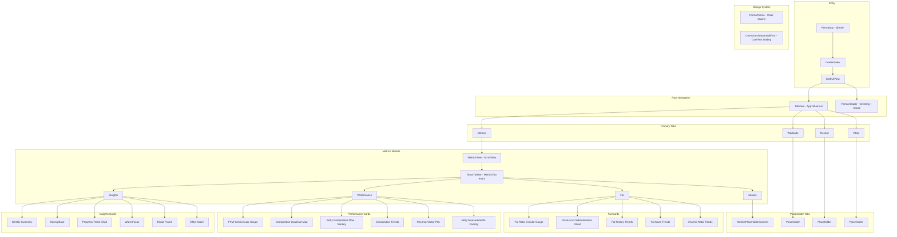

# Forma

A premium iOS body-composition and fitness analytics app built with SwiftUI. Forma surfaces detailed health metrics — body fat ratios, FFMI (Fat-Free Mass Index), body measurements, visceral fat trends, and more — through richly styled cards, custom gauges, and Swift Charts visualizations with a polished glass-morphism aesthetic.

## Features

- **Insights Dashboard** — Weekly summaries, progress trend charts, effort scores, waist and frame analysis cards
- **Body Fat Analytics** — Fat ratio circular gauge, visceral vs. subcutaneous donut charts, fat mass and ratio trend history
- **Performance Metrics** — FFMI semicircular gauge, composition quadrant map (FFMI vs. FMI), Sankey body-composition flow, recomp vector plot, body measurements overlay
- **Glass Morphism UI** — Depth-layered backgrounds, glass-effect tab bars, light/dark adaptive color tokens (iOS 18+)
- **Custom Typography** — Cormorant Garamond variable-weight serif font for brand identity
- **Swift Charts** — `LineMark`, `PointMark`, custom shapes, and gauge visualizations throughout

## Architecture

## Tech Stack

| Layer           | Technology                           |
| --------------- | ------------------------------------ |
| Language        | Swift 6                              |
| UI Framework    | SwiftUI (iOS 18+)                    |
| Charts          | Swift Charts (`LineMark`, `PointMark`, custom shapes) |
| Font Loading    | CoreText (`CTFontManagerRegisterFontsForURL`) |
| Design          | Glass-morphism, adaptive light/dark palette, Cormorant Garamond |

## Requirements

- Xcode 16+
- iOS 18.0+
- Swift 6

## Getting Started

1. Clone the repository
2. Open `Forma.xcodeproj` in Xcode
3. Select an iOS 18+ simulator or device
4. Build and run (⌘R)

## License

Forma is licensed under the [GNU Affero General Public License v3.0](LICENSE) — a strong copyleft license that requires derivative works and network service deployments to release their source code.
